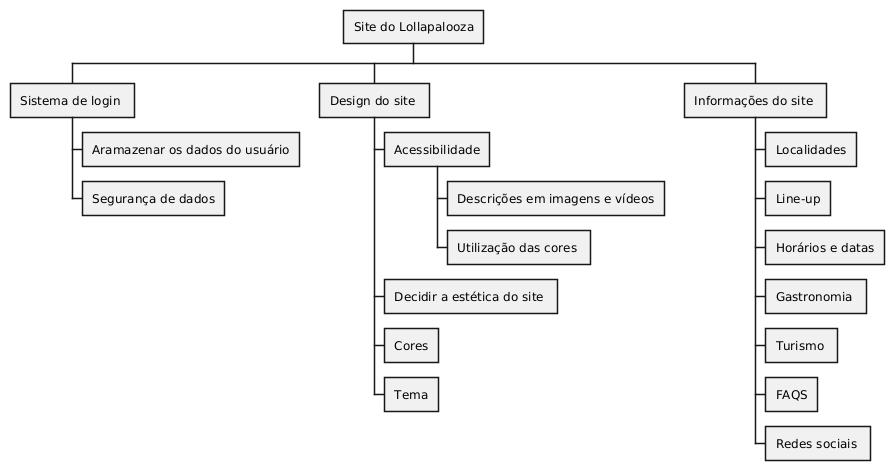

## Introdução

Para representar a divisão hierárquica do projeto utilizamos o PlantUML, que pode criar diagramas de pacotes (Package Diagram) ou diagramas de classes, dependendo de como deseja visualizar a hierarquia. PlantUML é uma ferramenta muito poderosa para gerar diagramas UML a partir de texto simples.

## Metodologia

 Prototipo em formato hierarquica do nosso site para uma melhor organização, contendo informaçoes de Design, usuário, sistema e informações dos produtos

 