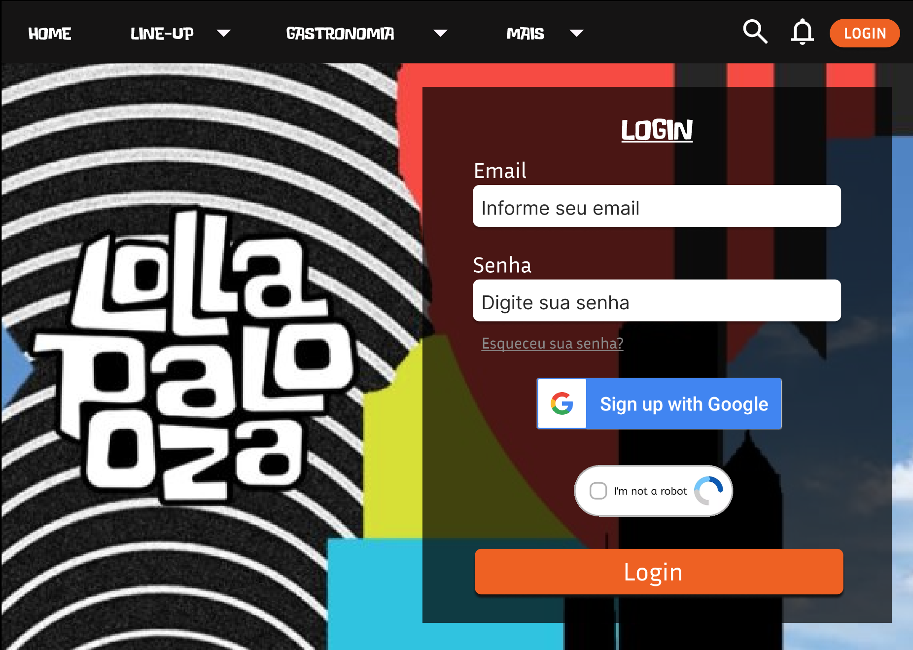
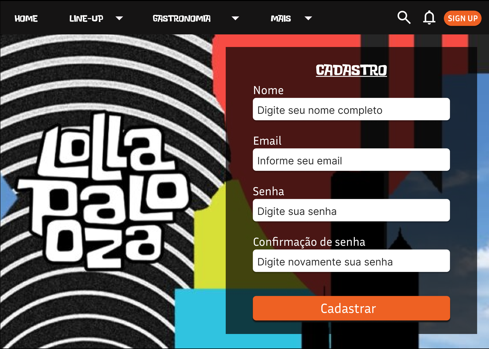
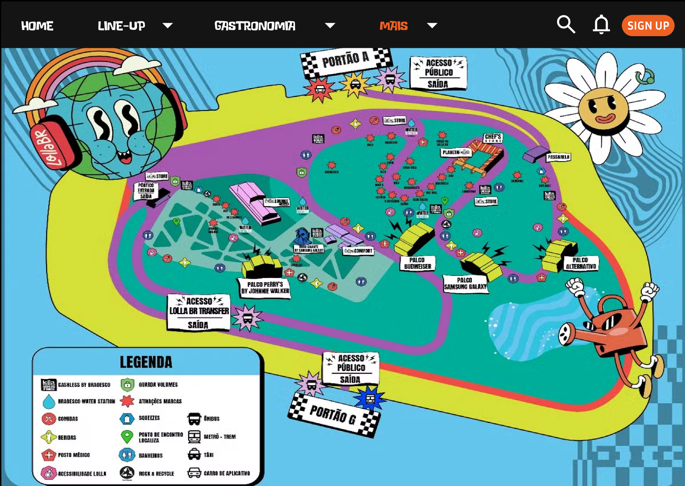
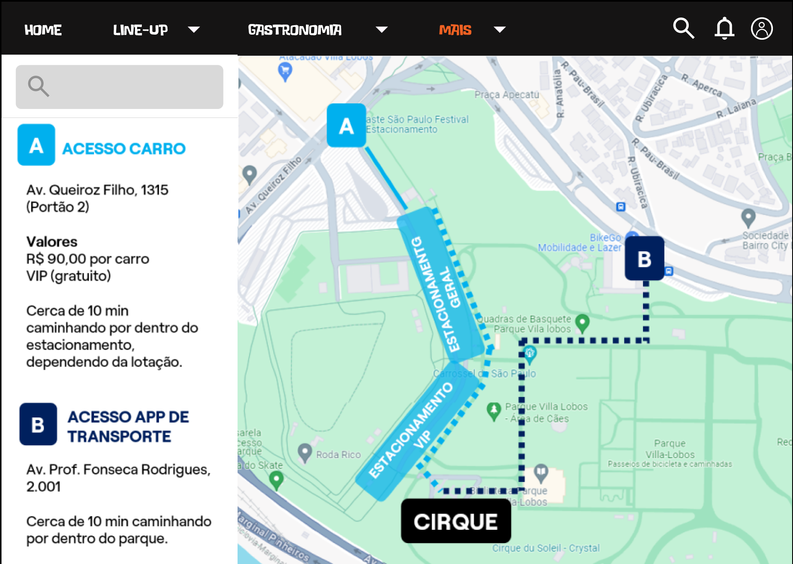
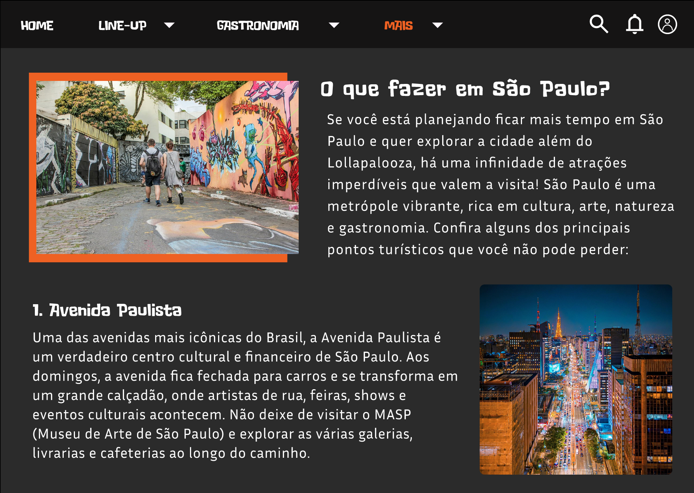

## Introdução

A construção do protótipo de alta fidelidade auxilia a equipe de desenvolvimento a encontrar um nível de detalhes abrangentes, extrair funcionalidades, testar usabilidade, e também fornece uma base para o gerenciamento do projeto pois com o protótipo é possível realizar estimativas de quanto tempo será necessário desempenhar em cada funcionalidade.

## Metodologia

Iniciamos o projeto através dos levantamentos iniciais da equipe, após discussões a ferramenta Figma foi selecionada para produzir o protótipo de alta fidelidade.

## Protótipo de alta fidelidade

### Versão 1.0

### Tela Login

### Tela Cadastro

### Tela Esqueceu Senha

### Tela Home sem Login

### Tela Home

### Tela Feed com configurações

### Tela Perfil

### Tela Cadastrar torneio 1

### Tela Cadastrar torneio 2

### Tela Cadastrar torneio 3

### Tela Mais > Mapa 

### Tela Mais > Mapa Interativo

### Tela Mais > Turismo 

Na primeira versão do protótipo utilizamos algumas bibliotecas do figma para auxiliar na criação do protótipo do aplicativo. 
Definimos as cores base do aplicativo baseado nas cores do Evento original. 
Decidimos manter a mesma identidade visual para a nossa plataforma. 

link para o primeiro <a href="https://www.figma.com/design/IcZ9VCCN5QX06BpDkJIxAy/Projeto-Front-End?node-id=0-1&node-type=canvas&t=CFpUV77uf46eb7gI-0">Protótipo no Figma</a>

### Versão 2.0

### Tela Login

### Tela Cadastro

### Tela Esqueceu Senha

### Tela Perfil

### Tela do Feed

### Tela Cadastrar em um torneio

### Tela Cadastrar torneio

### Tela Cadastrar torneio 2

### Tela dos meus torneios

### Tela das chaves do torneio

### Tela das estatíscicas

### Tela de adicionar resultado das partidas

link para o <a href="https://www.figma.com/design/IcZ9VCCN5QX06BpDkJIxAy/Projeto-Front-End?node-id=0-1&node-type=canvas&t=CFpUV77uf46eb7gI-0">Protótipo no Figma</a>

## Conclusão

A partir da elaboração do protótipo foi possível ter uma noção inicial da interface do usuário, definindo fluxo, paleta de cores, botões, app bars e diversas outras funcionalidades. 
Também ficou mais fácil de visualizar os requisitos da plataforma. 

## Referências

> PMI. Um guia do conhecimento em gerenciamento de projetos. Guia PMBOK® 5a. ed. EUA: Project Management Institute, 2013.

> Ferramenta Figma. Disponível em https://www.figma.com

## Autor(es)

| Data | Versão | Descrição | Autor(es) |
| -- | -- | -- | -- |
| 21/09/24 | 1.0 | Criação do documento | Sarah Ferrari |
| 22/09/24 | 1.1 | Adicionado as imagens do protótipo | Sarah Ferrari  |
| 07/09/20 | 1.2 | Adicionado conclusão e referências  | Lucas Alexandre e Matheus Estanislau  |
| 26/10/20 | 2.0 | Adicionada a versão 2.0 do protótipo| João Pedro, Lucas Alexandre, Matheus Estanislau, Moacir Mascarenha e Renan Cristyan|
